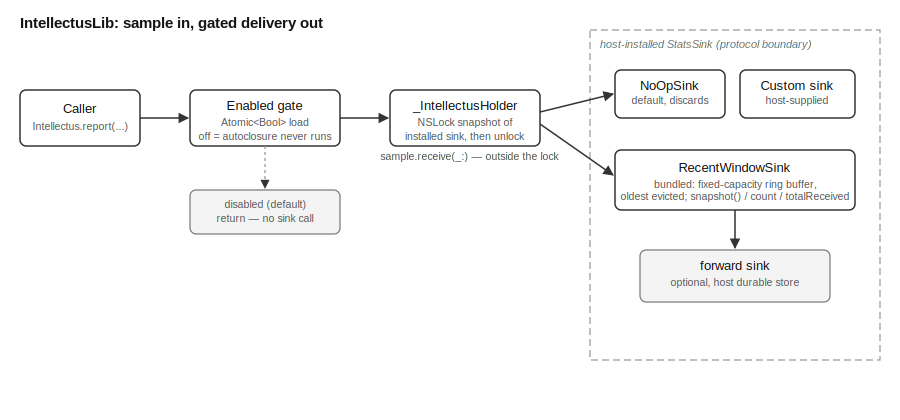

# IntellectusLib Overview

## What This Library Does

IntellectusLib lets any part of the MOOTx01 substrate report a small fact
about itself. The fact can be a number, such as a latency in milliseconds.
Or the fact can be a lifecycle event, such as a capture. The library calls
this small fact a telemetry sample.

A telemetry sample takes one of two forms. The first form is a named
measurement. An example is "capture latency was 42.5 milliseconds." The
second form is a record of a lifecycle transition. An example is "row X was
captured in estate Y."

The library does not decide what to do with a sample. It hands each sample
to a receiver called a sink. The host program installs that sink. A host
that wants to persist samples to disk installs a sink that writes to a
database. A host that only wants a live look at recent activity installs a
different kind of sink. That sink keeps the last few hundred samples in
memory.

IntellectusLib supplies one such sink, `RecentWindowSink`. It also supplies
a protocol, `StatsSink`, so any host can build its own sink.

## The Problem It Solves

Substrate code runs on a hot path. The same functions execute many times per
second. This happens while a user captures memories or the system dreams
through them. Measuring that code is valuable. An always-on measurement
system is not free, though. Building a telemetry payload costs time and
memory. That cost applies even if nothing reads the result afterward.

Most of the time, no one is watching. A production device runs with
monitoring off by default. IntellectusLib is built around one guarantee.
When monitoring is off, reporting a sample costs almost nothing. It costs a
single memory read and one comparison, and nothing more. The library never
builds a payload when monitoring is off. It never takes a lock in that case
either. It never calls a sink unless a host has explicitly turned monitoring
on. This guarantee lets substrate code call `Intellectus.report(...)` freely
and everywhere. A caller never has to worry about the cost of that call.

The library also must work correctly under concurrency. Many threads can
report samples at the same time, since the substrate itself runs
concurrently. Turning monitoring on or off must never corrupt a sample in
flight. Swapping in a new sink must never corrupt one either.

IntellectusLib keeps this promise through two independent implementations. A
Swift leg serves Apple platforms. A Rust leg, found in `rust/`, mirrors the
Swift leg section for section. It mirrors the Swift leg function for
function too. Hosts that need a Rust build of the substrate use this leg.
Both legs share one design. Each uses a lock-free flag for the on/off gate.
Each holds a lock only briefly, and only around the installed sink.

## How It Works

Reporting a sample happens in one call, `Intellectus.report(...)`. That call
takes an argument built lazily. Swift calls this feature `@autoclosure`. The
expression that builds the sample does not run right away. It runs only when
`report` decides it is needed.

`report` checks a single on/off flag first. If monitoring is off, the
function returns right away. The sample-building expression never runs at
all. Nothing is allocated. No sink is touched.

If monitoring is on, `report` reads the currently installed sink. It briefly
holds a lock while it does this. The lock stops it from reading a sink in
the middle of a swap. `report` then releases the lock. It builds the sample
next. Then it calls the sink's `receive(_:)` method. The sink runs outside
the lock. So a slow or reentrant sink cannot block a concurrent call. That
concurrent call might only want to install a new sink.

A host controls the gate with `Intellectus.setEnabled(_:)`. A host installs
a receiver with `Intellectus.install(sink:)`. Both calls are meant to run
rarely. A host typically calls them once, at startup. An operator may also
call them later, when toggling monitoring on or off.

The library ships one ready-to-use sink, `RecentWindowSink`. This sink keeps
a fixed-size buffer of the most recent samples in memory. The buffer evicts
its oldest entry first once it fills. A host can read that buffer at any
time to see recent activity. This is useful for a live dashboard or a
diagnostic command. `RecentWindowSink` can also wrap a second sink. It
forwards every sample to that second sink after recording it. This lets a
host keep a live window and also write to durable storage. Both actions come
from a single installed sink.

## How the Pieces Fit

Figure 1 shows the library's topology. It shows the major parts and how a
sample moves through them.

*Figure 1. Topology of IntellectusLib. A caller's report flows through the
enabled gate. When the gate is open, the sample reaches the installed sink.
That sink may be the bundled `RecentWindowSink`. It may in turn forward the
sample to a second, host-supplied sink. The dashed region marks the parts a
host supplies, apart from the library itself.*

`StatSample.swift` defines the data that flows through the system. It
defines the `StatSample` enum and its two cases, `.metric` and `.event`.
`StatsSink.swift` defines the receiver contract, `StatsSink`. It also
defines the default do-nothing receiver, `NoOpSink`. A host relies on
`NoOpSink` before it ever calls `install(sink:)`. `RecentWindowSink.swift`
provides the one concrete sink the library ships. `Intellectus.swift` ties
the pieces together. It holds the current sink and the on/off flag. It
exposes the `Intellectus` enum as the single public entry point. The rest of
the substrate calls through that one entry point.

## What Ships in the Package

The package ships four Swift source files. It also ships a matching Rust
port in `rust/`. The package has no dependency on any other library in the
repository. It does not even depend on the lowest substrate libraries. Those
libraries can therefore depend on IntellectusLib in turn. This avoids
creating a dependency cycle.

The package depends only on Foundation and on Swift's `Synchronization`
module. The platform supplies both. The platform floor is macOS 26 and iOS
26. That floor was chosen for one reason. It is the first OS release that
supports `Synchronization.Atomic` without a compatibility fallback.
