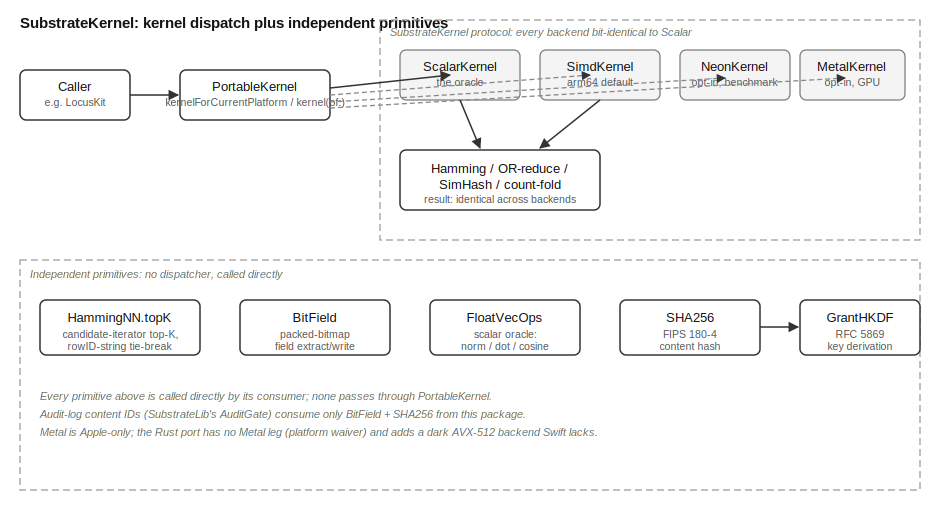

# SubstrateKernel Overview

## What This Library Does

`SubstrateKernel` computes bit-level and hash operations. MOOTx01 runs
them on every memory it stores. It compares fingerprints. It extracts
values from packed bitmaps. It computes cryptographic hashes.

A fingerprint is a short fixed-size code computed from a piece of
content. Similar content produces similar fingerprints. This lets the
system compare things fast, without reading them in full. This package
works with one fingerprint shape, `Fingerprint256`. It is a 256-bit
code held as four 64-bit blocks.

Comparing two fingerprints means counting how many bit positions differ
between them. This count is called Hamming distance. A smaller Hamming
distance means the two fingerprints are more alike. The content behind
each one is more alike too.

Finding the memories most similar to a query means finding the
fingerprints with the smallest Hamming distance to a probe fingerprint.
This is the single most frequent operation in MOOTx01's recall path. So
`SubstrateKernel` gives it several implementations. Each one suits a
different kind of hardware.

`SubstrateKernel` is layer 2 of a four-package substrate split. Layer 1
is `SubstrateTypes`. It defines pure data types with no logic, including
`Fingerprint256` itself. Layer 2 is this package. It computes over those
types. Layer 3 is `SubstrateML`. It builds learning and graph algorithms
on top of layer 2. Layer 4 is `SubstrateLib`. It orchestrates the whole
substrate for its callers.

A package that composes libraries into a larger subsystem is called a
kit. Kits depend on libraries like this one. The reverse never happens.
Four kits depend directly on `SubstrateKernel` for their hot paths:
`LocusKit`, `CorpusKit`, `GeniusLocusKit`, and `EngramLib`.

## The Problem It Solves

Two devices must agree on how similar two fingerprints are. A MOOTx01
estate is one user's complete memory store. Estates can federate. That
means separate devices share and compare memories. Suppose one device's
Hamming distance for a pair of fingerprints disagreed with another
device's distance for that same pair. Shared recall would then give
different answers on different hardware.

Every operation in this package must therefore produce the same output
for the same input. It must do so on every platform, every time. This
package calls that guarantee its conformance contract. It treats one
implementation, `ScalarKernel`, as the oracle. Every other implementation
must match that oracle bit for bit.

Meeting that contract while also running fast is hard. A scan over one
million fingerprints, at 32 bytes each, moves 32 megabytes through
memory for a single query. That much straight-line bit manipulation is
bandwidth-bound. Its cost comes from how fast data moves through the
processor, not from how complex the arithmetic is. Different processors
move that data at different speeds, depending on which instructions
they use. So one fixed implementation cannot be fastest everywhere.
`SubstrateKernel` solves this with one interface. Several interchangeable
implementations sit behind it. One reference implementation checks
every one of them.

A second, smaller problem is duplication. Many packages upstream of
`SubstrateKernel` need bit-field extraction from a packed bitmap. Many
also need content hashing for the audit log. Left unmanaged, each
package would write its own version. A change to the bit layout, or to
the hash algorithm, would then require updating every copy.
`SubstrateKernel` centralizes both operations. One implementation now
serves every caller.

## How It Works

The `SubstrateKernel` protocol declares the operations every backend
must supply. These include Hamming distance between two fingerprints,
top-K nearest neighbor search, and bitwise OR-reduction across a group
of fingerprints. They also include SimHash projection, which folds a
set of numbers into a fingerprint, plus batched variants of each
operation. `ScalarKernel` implements the protocol with a plain loop
over each fingerprint's four 64-bit blocks. It is always available, on
every platform. It is the oracle. Any implementation that disagrees
with it, on any input, is by definition wrong.

Three more implementations specialize the same protocol for particular
hardware. `SimdKernel` uses Swift's portable `simd` module. The
compiler turns this into ARM NEON instructions on Apple Silicon.
`NeonKernel` frames the same computation a different way. It works at
the byte level instead of the 64-bit-word level. This tests whether
that shape compiles to tighter machine code. `MetalKernel`
sends the batched Hamming distance computation to the GPU, through
Apple's Metal framework. This pays a fixed per-call setup cost. It then
scales well past roughly one hundred thousand candidates. A caller
picks an implementation through `PortableKernel`. It can choose one
automatically for the current platform, or ask for one by name for
testing.

Four more files round out the package. `BitField` extracts and writes
fixed-width fields inside a 64-bit packed bitmap. This is the encoding
MOOTx01 uses to pack several small values into one machine word.
`SHA256` computes a standard cryptographic hash. It gives each
audit-log entry a unique, content-derived identifier. Through `HKDF`,
it also derives keys for the estate's cryptographic grants.
`FloatVecOps` defines the canonical floating-point vector operations:
length, normalization, dot product, and cosine similarity. Any faster
backend for those operations must match it bit for bit. `HammingNN`
offers a simpler, general-purpose top-K search over any sequence of
candidates. It works independently of the `PortableKernel` backends,
for callers who do not need backend selection.

## How the Pieces Fit

Figure 1 shows the library's topology. It shows the major parts and how
data moves between them.

*Figure 1. Topology of SubstrateKernel. A caller asks `PortableKernel`
for a kernel. The dispatcher hands back one of four interchangeable
implementations of the `SubstrateKernel` protocol. All four are
conformance-gated against the `ScalarKernel` oracle. Five primitives
skip the dispatcher entirely: `HammingNN`, `BitField`, `SHA256`,
`HKDF`, and `FloatVecOps`.*

`PortableKernel.kernelForCurrentPlatform()` picks `SimdKernel` on
64-bit ARM. It falls back to `ScalarKernel` everywhere else. It never
selects `MetalKernel`. A caller who wants the GPU path must ask for it
by name, with `PortableKernel.kernel(of: .metal)`. `NeonKernel` is also
available only by explicit request. It exists to be measured against
`SimdKernel`, not to replace it automatically.

Whichever implementation runs, its output for a given input must match
`ScalarKernel`'s output for that same input. A conformance test suite
enforces this rule for every backend. It runs on both the Swift leg and
the Rust leg.

## What Ships in the Package

The package ships nine Swift source files. It ships no pinned data
artifacts. Unlike some sibling libraries, `SubstrateKernel`'s behavior
depends only on its algorithms, not on any versioned reference data.

The package also ships a Rust port, in `rust/`. This port mirrors every
file except two. `NeonKernel` has no Rust equivalent, because Rust's
portable-SIMD path already covers the same ground on the relevant
targets. `MetalKernel` has no Rust equivalent either, because Metal is
an Apple-only framework with no Linux or Windows counterpart.

The Rust leg adds one backend the Swift leg does not have: an AVX-512
implementation for x86-64 processors. This backend stays dark. It is
built and tested, and reachable only by explicit request. It is never
chosen automatically, until a future performance study proves it
belongs in the default path.
