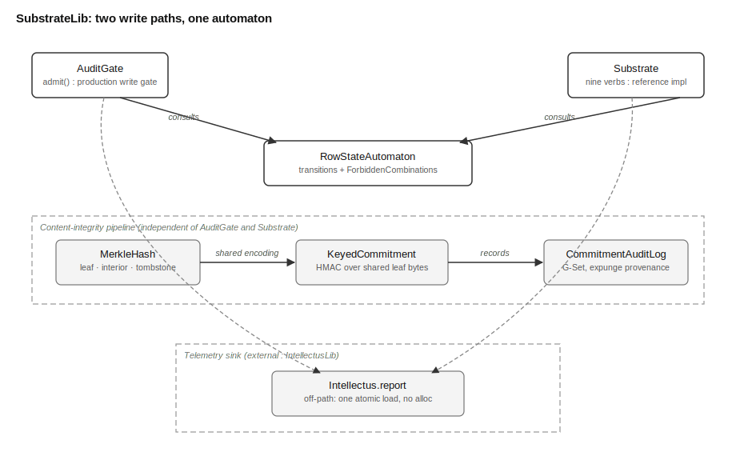

# SubstrateLib Overview

## What This Library Does

SubstrateLib is the orchestration layer of MOOTx01's storage substrate — the
part that decides what a legal change to a memory looks like, and refuses
every other kind. MOOTx01 is an on-device AI memory system. It stores what
an AI observes over time and helps the AI recall it later. Each stored
memory is one row: an entry with a lifecycle state, a link into the
classification lattice built by LatticeLib, and three 64-bit integers
called bitmaps that pack many small status fields — sensitivity, trust,
exportability, and more — into a compact wire form.

SubstrateLib supplies three things a row needs to stay trustworthy. First,
a single write gate, `AuditGate.admit`, that every bitmap mutation must
pass through. Second, a row-state automaton that says which of ten
lifecycle states a row may hold and which state changes are legal. Third,
a reference implementation of the nine verbs — the fixed vocabulary of
actions a row can undergo, such as capture, mutate, and withdraw — against
which production storage kits can check their own faster implementations.

Two supporting pipelines round out the package. A Merkle hash pipeline
computes deterministic content hashes so the system can prove a memory's
content is unchanged without re-reading the whole memory store. A
keyed-commitment pipeline proves that a piece of content once existed,
after the content itself has been destroyed to satisfy a deletion request.

The value types SubstrateLib operates on — `Row`, `RowState`, `NounType`,
`LatticeAnchor`, `AuditEvent` — live in the sibling package SubstrateTypes.
SubstrateLib imports them and adds the logic: the rules, the gate, and the
verbs.

## The Problem It Solves

MOOTx01 estates can federate, which means separate devices exchange and
merge memories. Merging only works cleanly if two devices that record the
same logical event compute the same event identifier. SubstrateLib gives
every audit event a deterministic content identifier: a SHA-256 hash of
the event's stable fields, folded into a UUID, rather than a random one.
Two replicas that reach the same write independently produce the same
identifier, so a grow-only set — a data structure that can gain entries
but never lose them, often called a G-Set — simply keeps one copy. A
random identifier would defeat this: the same logical event would look
like two different events on two devices, and federation would double-count
it.

A second problem is structural corruption. A row's status lives in three
64-bit integers, with several unrelated fields packed into each one at
fixed bit positions. Nothing at the type level stops a careless write from
touching the wrong bits, writing a value wider than its field, or moving a
row into a combination the design forbids — for example, marking a secret
memory as exportable. SubstrateLib closes this gap with one gate that every
write must pass. A write either lands as a legal value in a declared field,
producing a legal state and a legal combination of fields, or the gate
refuses it. Corruption of this kind becomes structurally unrepresentable,
not merely discouraged by convention.

A third problem is privacy against accountability. When a memory is
expunged, MOOTx01 destroys its content for good — a legal-compliance
requirement. But an audit trail that simply drops the event looks the same
whether nothing happened or something was hidden; from the outside, an
absence proves nothing. SubstrateLib's keyed-commitment pipeline resolves
this: it commits, cryptographically, to the fact that a payload existed,
using a secret key the estate holds, without retaining anything the
payload could be reconstructed from.

The mathematics in this package is conformance-gated. A Rust port in
`rust/` mirrors every algorithm, and shared test fixtures require both
legs to produce byte-identical output, so a device running the Swift leg
and a device running the Rust leg agree on every hash, every content
identifier, and every gate decision.

## How It Works

The write gate and the verb reference sit side by side, both built on the
same row-state automaton, but they serve different callers.

`AuditGate.admit` is the gate production kits call directly. A caller
supplies the row's identity, the prior snapshot of its bitmaps, and only
the field values it owns. The gate looks up each written field in the
instance's admitted vocabulary — the substrate's universal fields (state,
sensitivity, exportability, trust) plus whatever fields the calling kit
registered for itself — and rejects any field that is undeclared or any
value that is out of range or not in the field's legal set. It then reads
the prior bitmaps, writes only the addressed bits, and leaves everything
else untouched: a read-modify-write, never a blind overwrite. Before
returning, it re-derives the encoded state and checks that state against
what the supplied verb was allowed to produce, and checks the whole result
against the automaton's forbidden-combination rules. Only then does it
compute the deterministic content identifier and emit one canonical audit
event.

The row-state automaton itself is a fixed transition table: for each
(state, verb) pair, either a next state is defined, or the transition is
illegal and the automaton says so. Layered on top of the table is a second
check, the forbidden-combination rules, because a transition can be legal
in isolation yet still produce a field combination the design never
allows — a secret memory that is also exportable, for instance. Both
checks together are what "legal state" means in this package.

`Substrate`, the reference verb implementation, is a second, independent
route to the same guarantees. It is an in-memory struct that implements
all nine verbs end to end: it validates a mutation against the automaton
directly, applies the bitmap change, updates two summary structures called
matrices that track how many rows carry each field value, and appends an
audit event, all inside one call. Production storage engines — a SQLite
tail, a memory-mapped bit-slice tensor — reimplement these same nine verbs
against real persistence; `Substrate` is the scalar oracle they are tested
against, not itself the production path.

The two supporting pipelines are simpler and pure. The Merkle hash
pipeline builds a fixed byte encoding of a memory's content and vector
embeddings, tags it with a domain byte so a leaf hash can never be
mistaken for an interior or tombstone hash, and runs it through SHA-256.
The keyed-commitment pipeline reuses that same byte encoding with a
different domain tag, then runs it through a keyed HMAC instead of a
plain hash, binding the commitment to a secret only the estate holds.

Every one of these code paths — the gate, the verbs, both hash pipelines —
can report activity to an injected telemetry sink, but none of them ever
reads a clock or changes its output because monitoring is on. Timestamps
arrive as a caller-supplied parameter, and when the sink is disabled, the
entire telemetry call collapses to one lock-free flag check.

## How the Pieces Fit

Figure 1 shows the library's topology — its major parts and how a write
moves through them.

*Figure 1. Topology of SubstrateLib. Two independent write paths — the
production `AuditGate` and the reference `Substrate` verbs — both consult
the shared row-state automaton. A separate, unrelated pipeline computes
content hashes and keyed commitments for the integrity and privacy
guarantees. Both paths report to the telemetry sink, shown as a dashed
external region because it lives in the sibling package IntellectusLib.*

`AuditGate` and `Substrate` do not call one another. They are two
consumers of the same rules, not a pipeline where one feeds the other. A
kit such as LocusKit calls `AuditGate.admit` directly on every bitmap
write; `Substrate` exists so that alternative or future storage engines
have a known-correct in-memory reference to test against. Keeping them
independent, rather than layering one on the other, is deliberate: it
guarantees that a bug in the fast path cannot hide behind a passing
reference-path test, because the two paths share only the rules, not the
code.

## What Ships in the Package

The package ships the seven Swift sources listed above and the Rust port
in `rust/`, which mirrors each of them file for file. It ships no pinned
data artifacts of its own — no bundled JSON, no trained models — because
SubstrateLib's guarantees are entirely computational: a fixed transition
table, a fixed byte encoding, and a cryptographic hash, all deterministic
by construction rather than by shipped reference data. Conformance
fixtures live in `Tests/SubstrateLibConformanceTests/` and
`rust/tests/`, and both suites must pass before either leg changes ship.
