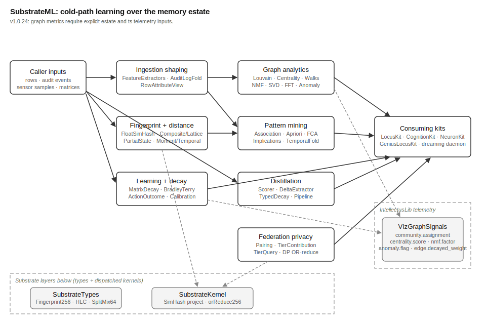

# SubstrateML Overview

## What This Library Does

SubstrateML is the learning layer of the MOOTx01 substrate. MOOTx01 is an
on-device AI memory system. It stores what an AI observes over time and
helps the AI recall it later. The substrate is the mathematical foundation
under that store: the types, the bit operations, and the algorithms that
every higher layer builds on.

The substrate is split into layered packages. `SubstrateTypes` holds pure
data types, such as the 256-bit row fingerprint. `SubstrateKernel` holds
hot-path bit operations that run on every capture. SubstrateML — this
package, layer 3 — holds the cold-path algorithms: the math that learns
structure from stored memories rather than storing them. A memory in this
system is a row: one record with a fingerprint, a classification anchor,
and a set of bitmap fields. SubstrateML never touches storage. Every
function here takes plain values in and returns plain values out.

Most of these algorithms run during dreaming. Dreaming is the system's
idle-time maintenance cycle: a background daemon that clusters, decays,
summarizes, and re-scores the memory estate while the device is otherwise
quiet. An estate is one user's complete memory store. The algorithms here
find the estate's themes, its communities, its habits, its rules, and its
condensable clusters — and they forget on schedule, so old evidence fades.

## The Problem It Solves

An on-device memory system must learn without a cloud. Cloud machine
learning changes without notice, needs a network, and sees private data.
SubstrateML instead ships small, exact, well-bounded reference algorithms
that run entirely on the device.

It must also learn identically everywhere. MOOTx01 estates can federate,
which means separate devices share and compare results. Two devices that
factor the same matrix or mine the same rules must get the same answer, or
shared recall falls apart. SubstrateML therefore holds one agreement
property across two implementations: a Swift leg for Apple platforms and a
Rust leg (in `rust/`) for everything else. Both legs use the same canonical
pseudo-random number generator (SplitMix64), the same pinned seeds, the
same tie-breaking rules, and the same arithmetic order, so results are
bit-identical. Conformance fixtures — recorded input and output pairs both
legs must reproduce exactly — gate every change.

Two library-wide rules protect that promise. First, SubstrateML never reads
a clock; every timestamp is passed in by the caller. Second, no algorithm
here holds hidden state; everything is a pure function or a plain value
type, safe to run from any thread.

## How It Works

The thirty-eight source files form seven working groups.

**Fingerprint and distance math.** A fingerprint is a short fixed-size code
computed from content; similar content gives similar fingerprints.
`FloatSimHash` projects float embedding vectors from external models into
the substrate's 256-bit fingerprint form. `CompositeDistance` blends
classification distance and fingerprint distance into the one score recall
ranks by. `LatticeDistance`, `PartialStateRecall`, and `ShingleSimilarity`
supply specialized distances. `MomentSummary` and `TemporalCompression`
OR-reduce many row fingerprints into one signature per time window, so the
system can ask "what was going on during this hour" as a single comparison.

**Ingestion shaping.** `FeatureExtractors` turns raw ambient sensor samples
(health, location, calendar, screen time, telemetry) into fingerprinted
rows. `AuditLogFold` replays a row's append-only change log to reconstruct
its state at any point in time. `RowAttributeView` reshapes that same log
into flat attribute lists that the pattern miners consume.

**Learning and decay.** `MatrixDecay` applies exponential half-life decay
to every statistics matrix — the system's forgetting mechanism.
`ActionOutcomeMatrix` tracks which actions succeed. `BradleyTerry` learns
per-row ranking strength from recall feedback. `LLMCalibrationCurve` tracks
how honest an LLM's confidence claims are. `Sampling` provides the
deterministic Normal, Gamma, and Beta samplers under Thompson-sampling
decisions.

**Graph analytics.** The estate graph connects rows by association.
`CommunityDetection` (Louvain) finds its clusters. `EigenvalueCentrality`
scores each row's authority for keystone recall. `RandomWalks` wanders the
graph for exploratory recall. `NMFAlternatingLeastSquares` factors the
matrices into latent themes. `AnomalyDetection` flags unusual values.
`JacobiSVD` and `FFT` supply the deterministic linear algebra and rhythm
analysis beneath semantic embeddings and periodicity detection. These five
graph algorithms emit telemetry signals, named in `VizGraphSignals`, when
monitoring is enabled.

**Pattern mining.** `AssociationRuleMining` and `AprioriMining` find
"when A is set, B tends to be set" rules. `FormalConceptAnalysis` and
`ConceptImplications` find exact groupings and always-true implications.
`TemporalCausalityFold` mines "X changed, then Y changed N minutes later"
statistics. `InformationTheory` supplies the entropy and divergence math.

**Distillation.** Distillation compresses a cluster of related memories
into one condensed factoid. `DistillationScorer` decides whether a cluster
is coherent enough. `DeltaFeatureExtractor` and `TypedDecayWeighting`
handle trends and staleness. `DistillationPipeline` runs the whole
five-stage algorithm and emits the factoid plus its fingerprint.

**Federation and privacy.** `PairingHandshake` lets two estates derive a
shared fingerprint basis with no extra network round trip.
`TierContributionFingerprint` packs an estate's shareable summary into a
fixed 64-byte wire format. `TierAscendingQuery` and `DPORReduction` add
differential-privacy noise and k-anonymity so aggregate answers never
expose any single estate's contribution.

## How the Pieces Fit

Figure 1 shows the library's topology — its major parts and how data moves
between them.

*Figure 1. Topology of SubstrateML. Rows, audit events, and sensor samples
enter on the left. The shaping layer feeds the four algorithm families.
Dashed regions mark the substrate packages below and the telemetry seam;
all outputs return to the calling kits, never to storage.*

SubstrateML has no single facade. Each algorithm family is its own entry
point, and the consuming kits — LocusKit, CognitionKit, GeniusLocusKit,
NeuronKit, and the dreaming daemon — call the piece they need. A kit is a
larger package that composes libraries into a subsystem; kits depend on
libs, never the reverse. The package depends downward only: on
`SubstrateTypes` for shared types, on `SubstrateKernel` for dispatched bit
kernels, and on `IntellectusLib`, the zero-dependency telemetry leaf. When
monitoring is off (the default), every telemetry emit costs one atomic
boolean load and nothing more.

## What Ships in the Package

The package ships the thirty-eight Swift sources, a matching test suite,
and the Rust port in `rust/` (crate `substrate-ml`, one module per Swift
file plus shared conformance tests). There are no bundled data artifacts;
every input is caller-supplied. Determinism is carried instead by pinned
constants — seeds, thresholds, half-lives, and bucket tables recorded in
the sources and locked by conformance vectors — so the same input produces
the same result on every platform, every time.
