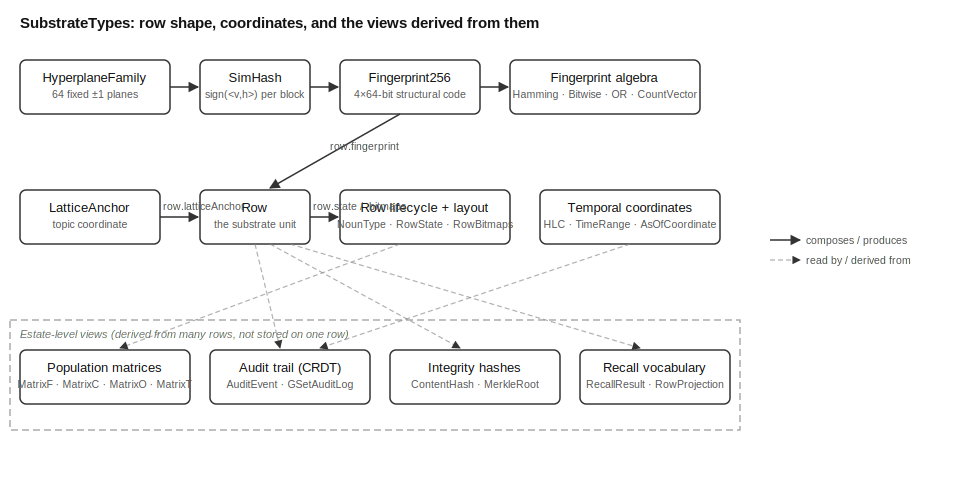

# SubstrateTypes Overview

## What This Library Does

SubstrateTypes defines the smallest shared unit of information that MOOTx01
stores: a row. A row is one recorded observation — a diary entry, a fact
pulled from a knowledge graph, a proposal, a sample of ambient context — held
in one common shape so every other library can read it and write it the same
way. SubstrateTypes is where that shape, and the handful of coordinate
systems attached to it, are defined once for the whole SDK.

Two coordinate systems ride on every row. A fingerprint is a 256-bit code
that captures structural similarity: rows that look alike in shape produce
fingerprints that share many bits. A lattice anchor is a compact reference to
a lattice code, the classification code that LatticeLib's FDC engine assigns;
rows about the same subject carry related anchors. A third value, the Hybrid
Logical Clock (HLC), timestamps every change to a row so that two devices
holding copies of the same estate can agree on the order of events without
trusting either device's wall clock.

Around these three coordinate systems sit a small set of pure, deterministic
functions: Hamming distance and bitwise arithmetic over fingerprints,
SimHash construction from hyperplane families, FNV string hashing, and
OR-reduction for combining many fingerprints into one. These functions are
"canonical reference compute" — not heavy algorithms, but the exact
arithmetic that every consumer of the shapes must reproduce identically, on
every platform, forever.

## The Problem It Solves

MOOTx01's higher libraries — the ones that rank memories, detect drift, or
sync an estate across a phone and a laptop — all need to talk about the same
row shape. Without one shared definition, each library would invent its own
version of a fingerprint or a timestamp, and the definitions would drift
apart. A comparison between two rows would then depend on which library
produced them, which breaks every guarantee the system makes about
comparing memories.

SubstrateTypes solves this by being the single, dependency-free home for
these shapes. It ships as the lowest of four packages that together make up
the substrate: SubstrateTypes (this package, pure shape and zero compute
beyond canonical reference arithmetic), SubstrateKernel (dispatch to
hardware-accelerated backends), SubstrateML (learned models), and
SubstrateLib (the orchestration layer, which still owns the row-state
automaton and the verb mechanics that operate the shapes). SubstrateTypes
depends on none of the other three. A library that only needs to describe a
row's shape — for example, ConvergenceKit, which serializes rows for
CloudKit — depends on SubstrateTypes alone and pulls in no compute it does
not need.

A second problem the package solves is cross-platform agreement. MOOTx01
estates can federate, so a Swift-based Apple client and a Rust-based
service must compute the identical Hamming distance, the identical
fingerprint, and the identical hash for the same input. The package ships a
Rust port in `rust/` that mirrors every type and function here, so both legs
of the SDK share one arithmetic contract.

## How It Works

Every row (`Row`) carries a fixed set of fields: an identifier, a noun type
(what kind of thing it is — a diary entry, a proposal, and so on), a
lifecycle state, three bitmap columns of adjective, operational, and
provenance flags, a fingerprint, a lattice anchor, and optional lineage and
content references. `RowState` and `RowBitmaps` describe the lifecycle and
the bitmap layout in more detail; both are pure data, so the automaton that
enforces which state transitions are legal lives one layer up, in
SubstrateLib.

The fingerprint is built by SimHash, a locality-sensitive hash: unlike a
cryptographic hash, where a one-bit change in the input scrambles the whole
output, SimHash produces outputs where similar inputs share many bits. Each
of the fingerprint's four 64-bit blocks is computed by comparing an input
vector against sixty-four random hyperplanes — flat dividing surfaces fixed
at estate creation — recorded in a `HyperplaneFamily`. Once built,
fingerprints are compared and combined by a small algebra: `Hamming.distance`
counts differing bits, `BitwiseArithmetic` computes intersection and
symmetric difference, `ORReduce` folds many fingerprints into one that keeps
their shared structure while losing which fingerprint contributed which bit,
and `CountVector256` accumulates per-bit counts across a whole cohort so a
majority-vote fingerprint, or any other statistic, can be read off later.

Every change to a row is recorded, never overwritten. `AuditEvent` is one
recorded mutation; `GSetAuditLog` is a grow-only set of such events, a
conflict-free replicated data type (CRDT). Two replicas of an estate can
exchange their audit logs in any order, merge by taking the union of
entries, and land on the same result, because set union does not care about
order. The `HLC` timestamp on every event gives the log a total order to
replay, and `TimeRange` and `AsOfCoordinate` let a caller ask what a row
looked like at a past point in that order.

A separate family of types tracks population-level statistics across an
entire estate rather than one row at a time. `MatrixF` counts how often each
bitmap bit is set across all rows; `MatrixC` derives the marginal probability
of each bit from `MatrixF`; `MatrixO` counts how often pairs of bitmap values
co-occur; `MatrixT` counts how often one bitmap value precedes another within
a time window, which is the substrate's tool for telling correlation apart
from likely causation. `ThreeDBitTensor` is the dense, bit-sliced storage
layout that answers "which rows have field X set to value Y" quickly across
a million rows.

A last family of types protects data integrity and supports recall.
`ContentHash` and `MerkleRoot` are two distinct fixed-size hashes —
one per leaf payload, one per subtree of children — kept as separate types so
the compiler rejects any code that confuses them; `MerkleDomain` supplies the
one-byte tags that keep leaf, interior, and tombstone hashes from ever
colliding. `RecallTypes` defines the wire vocabulary — `RecallScore`,
`RecallResult`, `DistanceBreakdown`, `RowProjection` — that every recall
primitive and every federation query returns, so composing results from
different recall strategies never requires an ad hoc translation step.

## How the Pieces Fit

Figure 1 shows how the major types connect: a row's own fields, the
fingerprint construction pipeline, the fingerprint algebra, the
population-statistics matrices, the audit trail, and the integrity and
recall vocabularies that read from a row without holding a reference to it.

*Figure 1. Topology of SubstrateTypes. A row carries a fingerprint and a
lattice anchor. Hyperplane families and SimHash build the fingerprint; the
fingerprint algebra (Hamming distance, bitwise arithmetic, OR-reduction,
count-vectors) operates on it afterward. The row's bitmaps feed the
population-statistics matrices. Every mutation is recorded as an audit event
under Hybrid-Logical-Clock ordering in the grow-only audit log. Integrity
hashes and the recall wire vocabulary both read from row data without
belonging to the row shape itself.*

Nothing in this package reaches upward. The row-state automaton, the verb
implementations that call it, and the full substrate object that bundles
rows with an audit log and the statistics matrices all remain in
SubstrateLib. SubstrateTypes supplies the vocabulary; SubstrateLib supplies
the behavior.

## What Ships in the Package

The package ships thirty Swift source files under `Sources/SubstrateTypes/`
and a mirrored Rust crate under `rust/src/`, one Rust module per Swift file
with matching names. There are no pinned data artifacts in this package —
unlike a library such as LatticeLib, SubstrateTypes carries no bundled
reference tables, because every value here is either supplied by a caller
(a hyperplane seed, a row's own fields) or computed from caller-supplied
input by a pure function (a Hamming distance, a SimHash block, an FNV hash).
Reproducibility rests on the arithmetic itself being pinned, verified by
conformance tests that check the Swift and Rust legs agree bit for bit.
